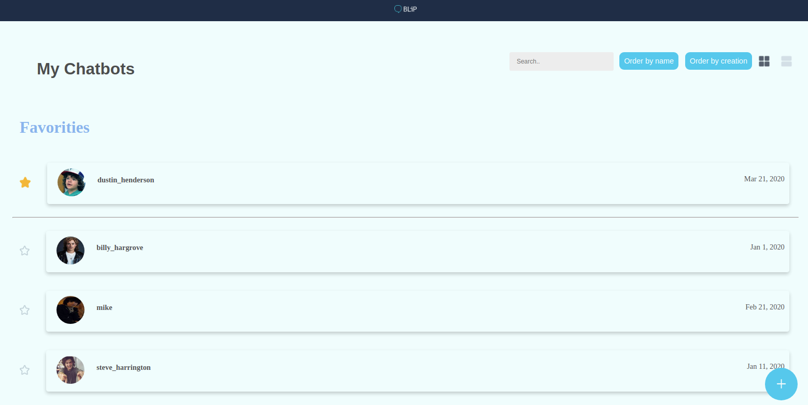

<h1 align="center">
  <a href="https://www.take.com/">
     Take Interview Task

  </a>
</h1>

[[Demo Take task]](https://www.youtube.com/watch?v=RQBMzmfh8eI&feature=youtu.be)

## 📋 Introdcution

 as Part of my interview task with TAKE company i built an angular project incuding unit test , e2e test , sharing test , responsive web page using css and ohers baic operations like filtering , mapping , sharing object between components and manage their state using Observebale and behavior subject properties , change displaying visualisation ... .

 
## 📋 what is requested 

  
  
  

## 📋 what i built 

  
  
  

## 📋 unit tests 

    

  ## 📋 e2e test

  

## 🎉 Key words  

- Angular 10 . 
- Unit test . 
- e2e test . 
- Shared style .
- responsive Web Site using CSS

## 📋 Requirements 

- Npm (node packages manager : https://phoenixnap.com/kb/install-node-js-npm-on-windows) 

- Node JS (https://www.geeksforgeeks.org/installation-of-node-js-on-linux/ ) 

- Angular CLI (https://www.codingforentrepreneurs.com/blog/angular-setup-guide) 

- Git  (https://www.atlassian.com/git/tutorials/install-git) 

## 📖 Run-the-project

- First open your terminal and clone the project in your PC using : git clone https://github.com/hamdirhibi/Take-Company-interview-task.git

- RUN npm install 

- RUN ng serve

Wow that's  super simple ? 

## 🚀 Test It ? 

that's it ? of course not , here you will find the url to test our APP : https://take-interview-task.herokuapp.com/

## 🚀 Docker IMAGE ! 

here you will find the docker image : https://hub.docker.com/repository/docker/hamdirhibi/take
  

to run it locally open your command line and follow those comands : 

- docker pull hamdirhibi/take:v0
- docker run -d -it -p 4444:4200/tcp --name take take:v0
- open your navigator and visit : http://localhost:4444/
- Bommm ! it's working 

  

##  Contact Me

don't hesitate to contact me if there any problem or suggestion :
- e-mail : geekrhibi@gmail.com
- linkedin : hamdirhibi
- telegram : 3ezdine junior

